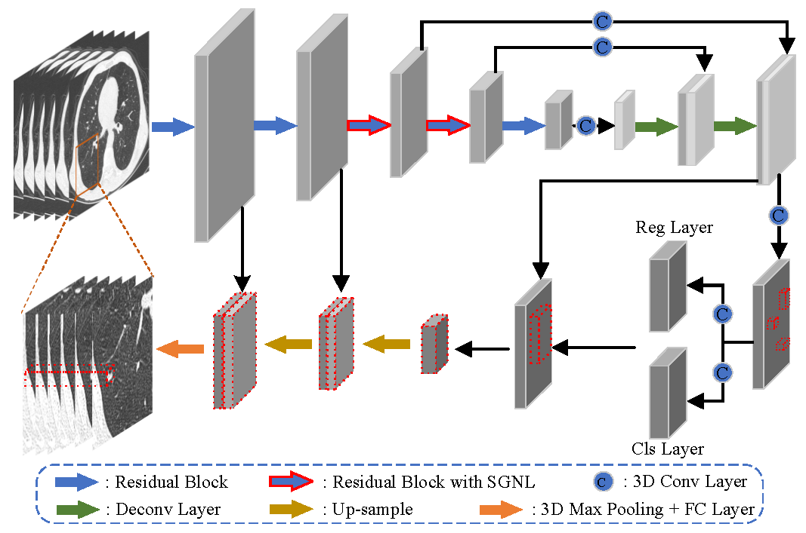

## SANet: A Slice-Aware Network for Pulmonary Nodule Detection

This paper ([SANet](https://ieeexplore.ieee.org/document/9373930)) has been accepted and early accessed in IEEE TPAMI 2021.

This code and our data are licensed for non-commerical research purpose only.

### Introduction

Lung cancer is the most common cause of cancer death worldwide. A timely diagnosis of the pulmonary nodules makes
it possible to detect lung cancer in the early stage, and thoracic computed tomography (CT) provides a convenient way to diagnose
nodules. However, it is hard even for experienced doctors to distinguish them from the massive CT slices. The currently existing nodule
datasets are limited in both scale and category, which is insufficient and greatly restricts its applications. In this paper, we collect
the largest and most diverse dataset named PN9 for pulmonary nodule detection by far. Specifically, it contains 8,798 CT scans and
40,439 annotated nodules from 9 common classes. We further propose a slice-aware network (SANet) for pulmonary nodule detection.
A slice grouped non-local (SGNL) module is developed to capture long-range dependencies among any positions and any channels
of one slice group in the feature map. And we introduce a 3D region proposal network to generate pulmonary nodule candidates
with high sensitivity, while this detection stage usually comes with many false positives. Subsequently, a false positive reduction
module (FPR) is proposed by using the multi-scale feature maps. To verify the performance of SANet and the significance of PN9,
we perform extensive experiments compared with several state-of-the-art 2D CNN-based and 3D CNN-based detection methods.
Promising evaluation results on PN9 prove the effectiveness of our proposed SANet.



### Citations

If you are using the code/model/data provided here in a publication, please consider citing:
    
    @article{21PAMI-SANet,
    title={SANet: A Slice-Aware Network for Pulmonary Nodule Detection},
    author={Jie Mei and Ming-Ming Cheng and Gang Xu and Lan-Ruo Wan and Huan Zhang},
    journal={IEEE transactions on pattern analysis and machine intelligence},
    year={2021},
    publisher={IEEE},
    doi={10.1109/TPAMI.2021.3065086}
    }

### Requirements

The code is built with the following libraries:

- Python 3.6 or higher
- CUDA 10.0 or higher
- [PyTorch](https://pytorch.org/) 1.2 or higher
- [tqdm](https://github.com/tqdm/tqdm.git)
- [scipy](https://www.scipy.org/)

Besides, you need to install a custom module for bounding box NMS and overlap calculation.
```
cd build/box
python setup.py install
```

### Data

Our new pulmonary nodule dataset PN9 is available now, please refer to [here](https://jiemei.xyz/publications/SANet) for more information.

**Note**: Considering the big size of raw data, we provide the PN9 dataset (after preprocessing as described in Sec. 5.2 of our paper) with two formats: .npy files and .jpg images. 
    The data preprocessing contains spatially normalized (including the imaging thickness and spacing, the normalized data is 1mm x 1mm x 1mm.) and transforming the data into [0, 255].
    The .npy files store the exact values of the corresponding samples while the .jpg images store the compressed ones. 
    The .jpg version of our dataset is provided with the consideration of reducing the size of PN9 for more convenient distribution over the internet. 
    We have done several ablation experiments on both versions of PN9 (i.e., .npy and .jpg), and the difference between the results basing on different data formats is little. 

Download the PN9 and add the information to `config.py`.

### Testing
The pretrained model of SANet with npy files can be downloaded [here](https://drive.google.com/file/d/1oGCsekgLAsZZl8VN3QrqAgZqzMZr_kks/view?usp=sharing).

Run the following scripts to evaluate the model and obtain the results of FROC analysis.
```
python test.py --weight='./results/model/model.ckpt' --out_dir='./results/' --test_set_name='./test.txt'
```

### Training
This implementation supports multi-gpu, `data_parallel` training.

Change training configuration and data configuration in `config.py`, especially the path to preprocessed data.

Run the training script:
```
python train.py
```

### Contact

For any questions, please contact me via e-mail: meijie@mail.nankai.edu.cn.

### Acknowledgment

This code is based on the [NoduleNet](https://github.com/uci-cbcl/NoduleNet) codebase.
